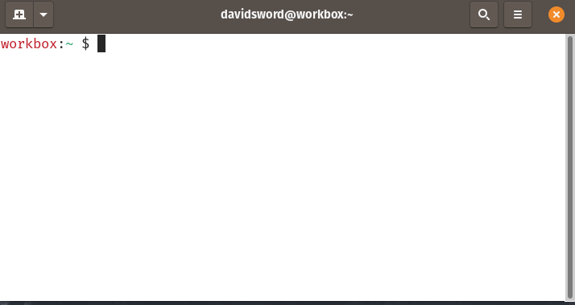

# Espanso Search

Search [Espanso](https://espanso.org) matches with `esp` command. For those hard-to-remember text expansion triggers.

## Installation

Requires [Espanso](https://espanso.org), [node](https://nodejs.org/) & [npm](https://www.npmjs.com/).

#### Download

```
git clone git@github.com:davidsword/espanso-search.git
cd espanso-search/
```

#### Install globally

```
npm install -g .
```

## Usage 

```
$ esp <keyword> 
```

Lists out matches from the query (fuzzy searches triggers and replacements). 
Hit `Enter` to copy the selected matches replacement value to clipboard.

